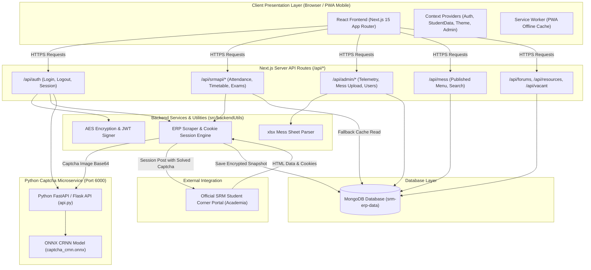

# SRM ERP 2.0


**SRM ERP 2.0** is a modern, high-performance student and administrator web application built for SRM University AP. It serves as an enhanced interface that seamlessly connects with the official SRM Student Corner portal, featuring server-side ERP scraping, ONNX neural-network automated captcha solving, MongoDB session-backed data caching, instant offline PWA support, and an automated Excel-driven Mess Management System.

---

## 🏗️ System Architecture Diagram

The system employs a multi-tiered architecture separating client presentation, Next.js server route handlers, backend scraping/crypto utilities, an isolated Python ONNX microservice, and a encrypted MongoDB persistence layer.



---

## 🗄️ Entity-Relationship (ER) Diagram

The persistent database `srm-erp-data` stores encrypted snapshots of student sessions, academic records, forum communications, administrative telemetry, mess menus, and campus resources.

```mermaid
erDiagram
    STUDENTS ||--o{ ATTENDANCE : "owns"
    STUDENTS ||--o{ TIMETABLE : "has_enrolled"
    STUDENTS ||--o{ EXAMS_RESULTS : "achieves"
    STUDENTS ||--o{ FORUMS : "posts"
    STUDENTS ||--o{ NOTIFICATIONS : "receives"
    STUDENTS ||--o{ FEEDBACK : "submits"
    ADMIN ||--o{ MESS_MENU : "manages_and_publishes"
    ADMIN ||--o{ RESOURCES : "uploads"
    ADMIN ||--o{ ANNOUNCEMENTS : "broadcasts"

    STUDENTS {
        string studentId PK "Registration Number (AP...)"
        string name "Student Full Name"
        string email "Student Email"
        string department "Branch / Major"
        string semester "Current Semester"
        string encryptedSessionData "AES Encrypted Session Payload"
        string status "ACTIVE | BLOCKED"
        datetime lastLogin "Timestamp of Last Access"
        datetime updatedAt "Last Sync Time"
    }

    ATTENDANCE {
        ObjectId id PK
        string studentId FK
        string subjectCode "Course Code"
        string subjectTitle "Course Title"
        string category "Theory | Practical"
        int conductedHours "Total Hours Taught"
        int attendedHours "Total Hours Attended"
        float percentage "Attendance Percentage"
        datetime updatedAt
    }

    TIMETABLE {
        ObjectId id PK
        string studentId FK
        string day "Monday - Saturday"
        string slot "Time Period Slot"
        string subjectCode "Course Code"
        string roomNo "Classroom / Hall Number"
        string facultyName "Instructor Name"
    }

    EXAMS_RESULTS {
        ObjectId id PK
        string studentId FK
        string subjectCode "Course Code"
        string testName "CLA-1 | CLA-2 | Semester Exam"
        float marksObtained "Scored Marks"
        float maxMarks "Maximum Possible Marks"
        string grade "Letter Grade (S, A, B, C...)"
        datetime testDate
    }

    MESS_MENU {
        string id PK "mess_menu_data"
        object draft "Raw excel parsed menus (South, North, Intl)"
        object published "Live active menus (South, North, Intl)"
        datetime uploadedAt "Upload Timestamp"
        datetime publishedAt "Publish Timestamp"
    }

    RESOURCES {
        ObjectId id PK
        string key "courses | resource"
        string title "Resource Title"
        string subjectCode "Target Course"
        string fileUrl "Storage / Attachment URL"
        string category "Notes | Question Paper | Lab Manual"
        string uploadedBy FK "Admin ID"
        datetime createdAt
    }

    SUBJECTS {
        ObjectId id PK
        string key "subjects"
        object data "Complete Subject Catalog & Syllabus Data"
    }

    FORUMS {
        ObjectId id PK
        string studentId FK
        string authorName "Student Display Name"
        string title "Discussion Title"
        string content "Body Content"
        string category "General | Academics | Events"
        array replies "List of Reply Objects"
        datetime createdAt
    }

    NOTIFICATIONS {
        ObjectId id PK
        string studentId FK "Optional FK (Null for Campus-wide)"
        string title "Alert Title"
        string message "Alert Body"
        string priority "low | medium | high | critical"
        boolean isRead "Read Indicator"
        datetime timestamp
    }

    VACANT_CLASSROOMS {
        string key PK "matrix"
        object data "Matrix of free rooms per building/slot"
        datetime updatedAt
    }

    FEEDBACK {
        ObjectId id PK
        string studentId FK
        string comment "Feedback Message"
        int rating "Rating (1 to 5)"
        datetime createdAt
    }

    ADMIN_TELEMETRY {
        ObjectId id PK
        int activeUsers24h "Active Student Count (24h)"
        int totalLogins "Total System Logins"
        float captchaSuccessRate "AI Captcha Precision Rate"
        float avgErpResponseTimeMs "Average Latency (ms)"
        datetime timestamp
    }
```



---

## ⭐ Complete Feature Matrix

### 1. 🎓 Student Portal (`src/app/(protected)`)
* **Interactive Dashboard (`/dashboard`)**: Unified academic hub displaying attendance summary widgets, upcoming timetable classes, active announcements, notifications, and quick metrics.
* **Attendance Tracking & Calculator (`/attendance`, `/checkattendance`, `/markattendance`)**:
  * Real-time subject-wise attendance percentages, conducted hours, and attended hours.
  * **Target Calculator**: Calculate exact classes needed to achieve 75%, 85%, or 90% threshold, or calculate how many classes can be safely skipped.
  * **Manual Logging**: Mark attendance logs and overrides.
* **Timetable Schedule (`/timetable`)**: Weekly course schedule grid displaying time slots, room numbers, course codes, and instructor details.
* **Exams & Internal Marks (`/exams`)**: Complete breakdown of CLA-1, CLA-2, assignment marks, semester exam schedules, and historical letter grades.
* **CGPA & SGPA Calculator (`/cgpa-calculator`)**: Interactive GPA planner for predicting target semester grades and credit weight calculations.
* **Mess Management System (`/mess`)**:
  * **Multi-Mess Schedules**: Live menus for South Mess, North Mess, and International Mess across Breakfast, Lunch, Snacks, and Dinner.
  * **Live Meal Detector**: Automatic detection of active dining hours and current serving meal.
  * **Cross-Mess Food Search Engine**: Instantly search for specific items (e.g. "Paneer", "Biryani", "Chicken") to find which mess and day they are served.
  * **Favorite Tracker**: Save favorite foods to client memory with glowing heart ❤️ notifications when served in upcoming meals.
  * **Special Item Glow**: Automatic highlights for high-demand items (Paneer, Chicken, Biryani, Desserts).
* **Vacant Classroom Matrix Locator (`/vacant`)**: Live matrix showing empty classrooms across campus academic blocks, floors, and time slots for self-study and group work.
* **Course Resources & Files (`/resources`)**: Repository for downloading lecture notes, lab manuals, syllabus files, and previous year question papers.
* **Community Forums (`/forums`)**: Student discussion board for academic queries, campus announcements, student topics, and peer answers.
* **Academic Calendar (`/academic-calendar`)**: Interactive university calendar displaying instruction days, exam periods, and official holidays.
* **Hostel & Transport Directories (`/hostel-info`, `/transport`)**: Hostel regulations, warden contacts, bus routes, pickup points, and bus timing schedules.
* **Personalization & Dark Theme (`/settings`, `/profile`)**: Seamless switching between Dark Mode and Light Mode, user preference persistence, and student profile inspection.

### 2. 🛡️ Admin Command Center (`src/app/(protected)/admin`)
* **Telemetry & Analytics Dashboard**: Live system health telemetry monitoring active 24-hour student count, total logins, ONNX captcha accuracy rate, and average ERP response times.
* **User & Student Management**: Comprehensive student directory with search, filtering, and account lock/unlock status controls.
* **Excel-Driven Mess Coordinator**:
  * **SheetJS Parser**: Automatic parsing of multi-tab Excel files (`South Mess`, `North Mess`, `International Mess`).
  * **Draft Preview & Grid Editor**: Interactive draft preview with inline cell editing for immediate meal adjustments.
  * **Publish & Purge Controls**: One-click publishing to live student feeds or full database menu purging.
* **Resource & Notification Dispatcher**: Upload study materials and dispatch site-wide priority notifications (`low`, `medium`, `high`, `critical`).
* **Maintenance Mode Switch**: Emergency system toggle to restrict student access during portal maintenance.

### 3. 🤖 Python AI Captcha Microservice (`python/api.py`)
* **CRNN Neural Network Engine**: Pre-trained ONNX model (`captcha_crnn.onnx`) running on Python 3.12 with OpenCV and ONNX Runtime.
* **Zero-Touch Automation**: Receives base64 captcha images from the Next.js login handler, predicts text characters, and returns the solved string within milliseconds.

### 4. 📱 Progressive Web App (PWA)
* **Mobile Ready**: Built with Service Worker support (`sw.js`) and web app manifests for home-screen installation on iOS and Android devices.
* **Offline Fallbacks**: Graceful client-side caching when live internet connection or official ERP access is interrupted.

---

## ⚡ Data Flow & Authentication Pipeline

```
1. Client Submission   ==> Student enters credentials on /login.
2. Captcha Solving     ==> Next.js API captures official ERP captcha image and sends it to Python microservice (Port 6000).
3. Session Handshake   ==> Next.js backend posts credentials + solved captcha to SRM Student Corner (Academia).
4. Data Encrypt & Store ==> On successful auth, session cookies are encrypted with AES-256 and cached in MongoDB.
5. JWT Issuance        ==> Client receives a secure JWT token for subsequent API authorization.
6. Graceful Fallbacks  ==> If official ERP experiences downtime, /api/srmapi/* endpoints return cached MongoDB snapshot data automatically.
```

---

## 🛠️ Technology Stack

* **Frontend**: Next.js 15 (App Router), React 19, TypeScript, Tailwind CSS, Lucide React, PWA Service Worker
* **Backend API**: Next.js Route Handlers, Node.js, `mongodb` native driver, `jsonwebtoken`, `crypto-js`, `xlsx` (SheetJS)
* **Machine Learning / Captcha Service**: Python 3.12, ONNX Runtime, OpenCV, NumPy, Flask / FastAPI
* **Database**: MongoDB 6.0 (`srm-erp-data`)

---

## 🚀 Getting Started

### Prerequisites

* **Node.js**: v18.0.0 or higher
* **Python**: v3.12 or higher
* **MongoDB**: A running MongoDB instance (Local or MongoDB Atlas)

---

### Environment Setup

Create a `.env` file in the root directory:

```dotenv
NODE_ENV=development
MONGO_URI="mongodb://localhost:27017/srm-erp-data"
LIMIT=20
ACCESS_SECRET="your-jwt-access-secret-key"
ENCRYPT_SECRET="your-aes-encryption-secret-key"
ACCESS_EXPIRE=365
D_REPORT=""
NEXT_PUBLIC_SITE_URL="http://localhost:3000"
```

---

### Installation

1. **Install Node.js dependencies**:
   ```bash
   npm install
   ```

2. **Install Python Captcha service dependencies**:
   ```bash
   python -m pip install -r python/requirements.txt
   ```

---

### Running the Application

1. **Start the Python Captcha Service (Port 6000)**:
   ```bash
   python python/api.py
   ```

2. **Start the Next.js Development Server (Port 3000)**:
   ```bash
   npm run dev
   ```

3. **Open Application**: Navigate to `http://localhost:3000` in your web browser.

---

## 📜 Available NPM Scripts

| Script | Purpose |
| :--- | :--- |
| `npm run dev` | Starts Next.js development server with Turbopack fast refreshing. |
| `npm run build` | Builds the production bundle and generates PWA service workers. |
| `npm run start` | Runs the compiled Next.js production build on port 3000. |
| `npm run full` | Preloads helper services and launches the production server. |
| `npm run lint` | Executes ESLint to check for code syntax and quality errors. |

---

## 📁 Repository Directory Structure

```
SRMAPI/
├── docs/                      # Module specifications & design documentation
│   ├── ADMIN_PORTAL.md
│   ├── ARCHITECTURE_REPORT.md
│   ├── ERP_DATA_FLOW.md
│   ├── FEATURES.md
│   ├── MESS_MODULE.md
│   └── STUDENT_PORTAL.md
├── python/                    # ONNX Captcha microservice
│   ├── api.py                 # Python API service (Port 6000)
│   ├── captcha_crnn.onnx      # Pre-trained CRNN captcha recognition model
│   └── requirements.txt       # Python dependencies
├── public/                    # Static web assets & PWA manifest
├── scripts/                   # Debug utilities & data sync scripts
├── src/
│   ├── app/                   # Next.js App Router
│   │   ├── (protected)/       # Authenticated student & admin pages
│   │   ├── (public)/          # Unauthenticated login/forgot pages
│   │   └── api/               # API route handlers (auth, srmapi, admin, mess...)
│   ├── backendUtils/          # Server-side ERP scraper, crypto, and session utilities
│   ├── components/            # Reusable React UI components and layouts
│   ├── context/               # React Context state providers
│   ├── data/                  # Static datasets (vacant rooms, faculty, feedback)
│   ├── lib/                   # Database drivers and Mongo helpers
│   ├── types/                 # TypeScript interfaces and data models
│   └── validators/            # Input validation routines
└── README.md                  # Project overview & documentation
```

---

## 🔒 Security & Privacy Guidelines

1. **Secret Key Management**: Always set strong, unique values for `ACCESS_SECRET` and `ENCRYPT_SECRET` in production environments. Never commit `.env` to source control.
2. **Credential Confidentiality**: Student passwords and ERP cookies are encrypted using AES-256 before storage in MongoDB.
3. **Route Protection**: All administrative and student APIs enforce JWT bearer token validation on every request.
